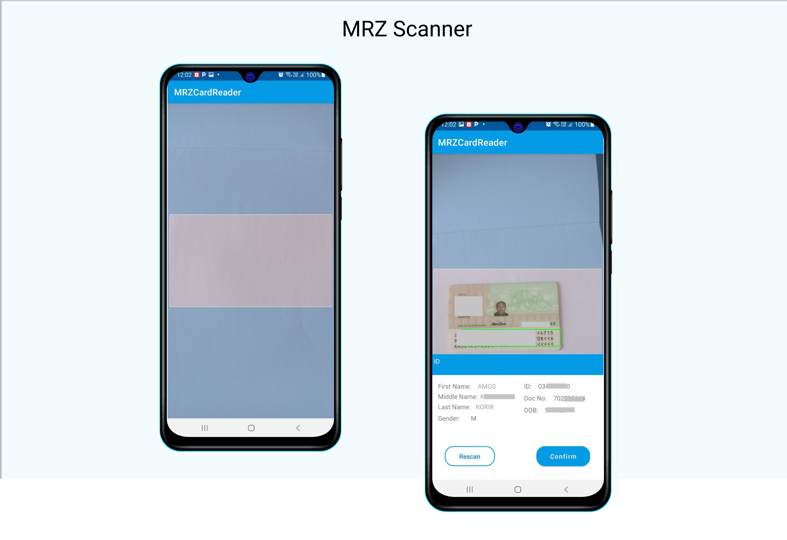

# MRZ Scannner


# 🚧 ___🚧 ___🚧 __🚧 - Ongoing Construction

Android Library for scanning document MRZ documents.

**Current Supported documents**

1. Nation ID
2. Passport ->development

<table>
<tr>
<td>

</td>

</tr>
</table>

**Installation**

Add the Following to your gradle file.

```java
         NEW VERSION JITPACK DEPENDENCY
         //TODO add dependency
```

 How to start reading

```kotlin
     MrzBuilder(this, this.activityResultRegistry)
            .setOnCardDetailsResponse(object : CardDetailResponse {
                override fun onCardRead(card: IdData) {
                    Toast.makeText(this@MainActivity, card.toString(), Toast.LENGTH_SHORT).show()

                }

                override fun onCardReadingCancelled() {
                    Toast.makeText(this@MainActivity, "Cancelled", Toast.LENGTH_SHORT).show()
                }

                override fun onFailed(e: Exception) {
                    Toast.makeText(this@MainActivity, e.toString(), Toast.LENGTH_SHORT).show()
                }

            })
            .start()
```


**⚙️ ⚙️  ⚙️ ⚙️**  MRZ reading Algorithms

Depend on a jar that is currently maintained in a separate private repository


